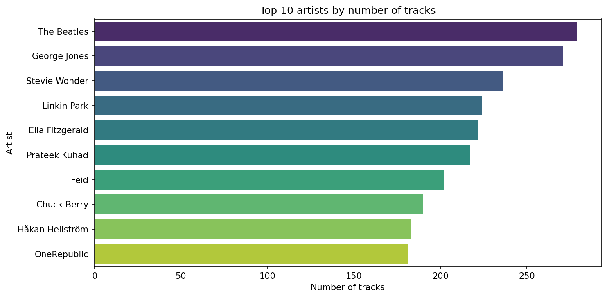
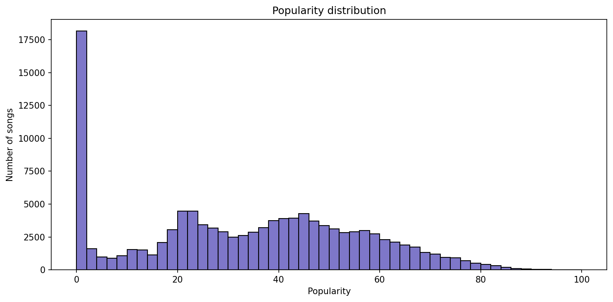
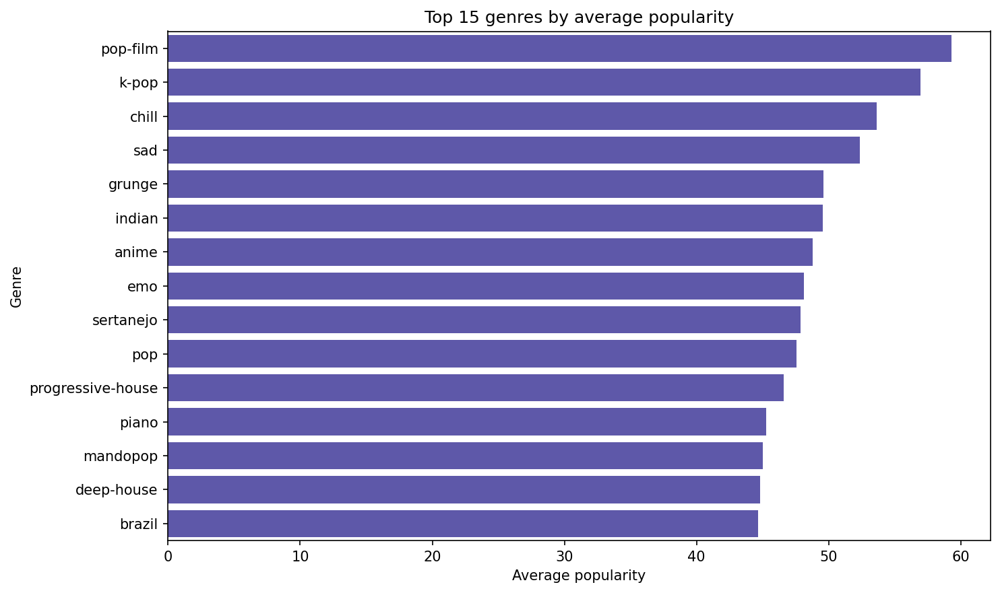
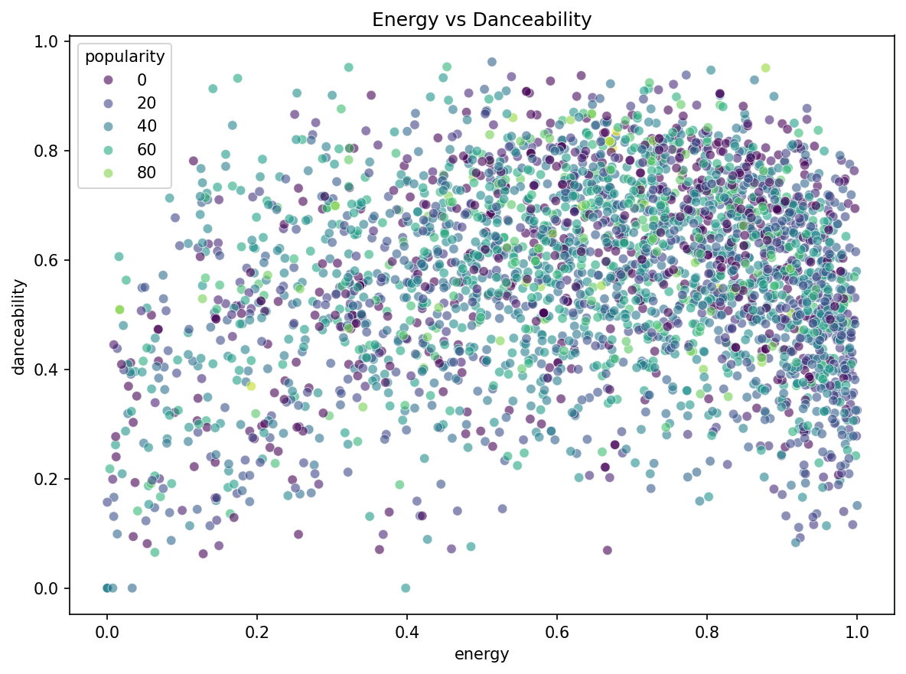
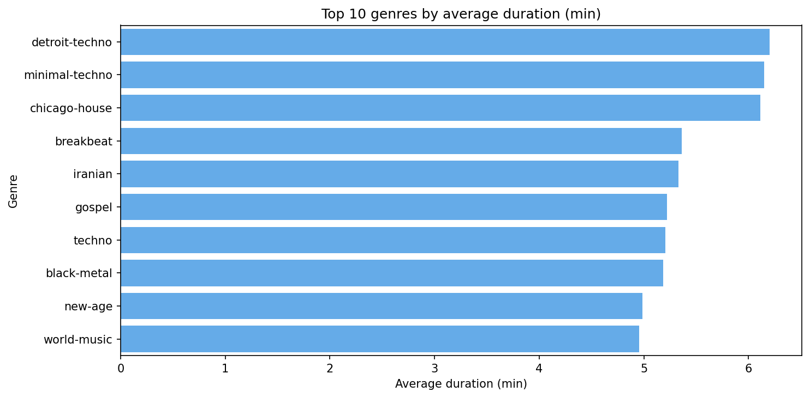
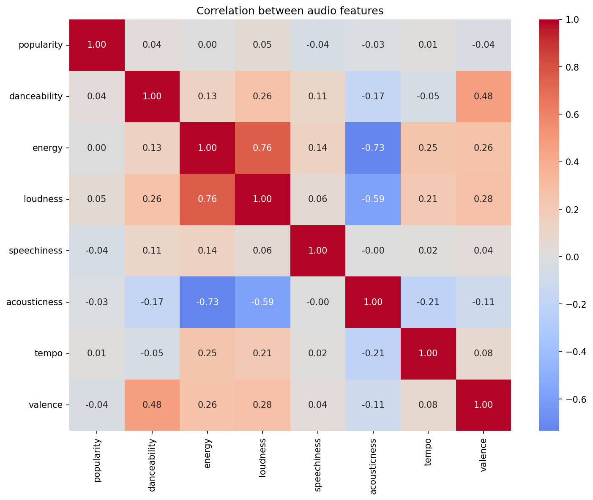
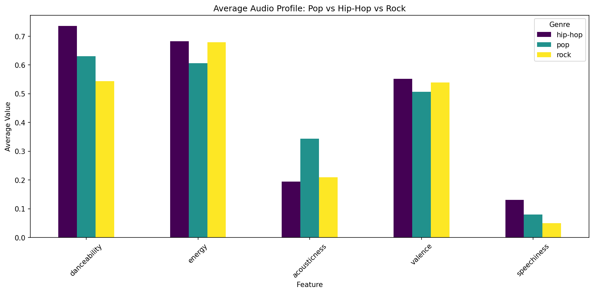

# Spotify Data Analysis

Exploratory data analysis on a dataset of 114,000+ Spotify tracks, built with Python, Pandas, Matplotlib, and Seaborn.

---

## Charts

### Top 10 artists by number of tracks


### Popularity distribution


### Top 15 genres by average popularity


### Energy vs Danceability


### Top 10 genres by average duration


### Correlation between audio features


### Average audio profile: Pop vs Hip-Hop vs Rock


---

## Key Findings

- The dataset contains **113,999 tracks** across 114 genres
- Most songs have a popularity score **close to zero** — a small number dominate
- **The Beatles** have the highest track count in the dataset (~250 tracks)
- **Detroit-techno and minimal-techno** have the longest average track duration — typical for DJ-oriented genres
- **Energy and loudness** are strongly correlated (0.76) — louder songs tend to be more energetic
- **Energy and acousticness** are strongly negatively correlated (-0.73)
- **Pop, hip-hop, and rock** show distinct and recognizable audio profiles

---

## Project Structure

```
spotify-analysis/
├── data/
│   └── dataset.csv          ← not included (see below)
├── notebooks/
│   └── analysis.ipynb       ← full analysis with inline charts
├── src/
│   └── analysis.py          ← standalone script, saves charts to output/
├── output/
│   └── charts/              ← generated PNG charts
├── requirements.txt
└── README.md
```

---

## Dataset

**Spotify Tracks Dataset** — 114,000 tracks with 21 audio features per track.

Download from Kaggle: [spotify-tracks-dataset](https://www.kaggle.com/datasets/maharshipandya/-spotify-tracks-dataset)

Place the CSV file at `data/dataset.csv` before running the analysis.

---

## Setup

```bash
git clone https://github.com/Giordano0/spotify-analysis.git
cd spotify-analysis

python3 -m venv venv
source venv/bin/activate

pip install -r requirements.txt
```

**Run the notebook:**
```bash
jupyter notebook
```
Open `notebooks/analysis.ipynb`.

**Run the script:**
```bash
python src/analysis.py
```
Charts are saved to `output/charts/`.

---

## Tech Stack

| Layer | Technology |
|---|---|
| Language | Python 3.12 |
| Data manipulation | Pandas |
| Visualization | Matplotlib, Seaborn |
| Notebook | Jupyter |
| Dataset | Kaggle — Spotify Tracks Dataset |

---

## License

This project is open source and available under the [MIT License](LICENSE).
